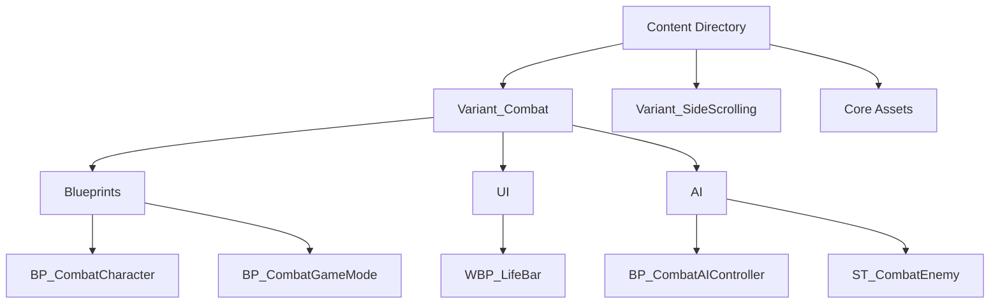

# Analyze Blueprints

Analyze Unreal Engine Blueprints in the project for naming conventions, structure, and best practices.

## Instructions

This command performs Phase 1 analysis (lightweight/filesystem-based) of Blueprint assets in the project.

### Analysis Steps

1. **Scan Content Directory**
   - Search for all `.uasset` files in the Content directory
   - Identify Blueprint-related assets by file path patterns

2. **Naming Convention Check**
   - Verify proper prefixes are used:
     - `BP_` - Blueprint classes
     - `WBP_` - Widget Blueprints (UI)
     - `M_` - Materials
     - `MI_` - Material Instances
     - `T_` - Textures
     - `IA_` - Input Actions
     - `IMC_` - Input Mapping Contexts
     - `NS_` - Niagara Systems (VFX)
     - `ST_` - State Trees (AI)
   - Report files that don't follow conventions

3. **Folder Structure Analysis**
   - Check if assets are organized properly:
     - Blueprints should be in `Blueprints/` subdirectories
     - UI widgets in `UI/` subdirectories
     - Materials in `Materials/` subdirectories
     - AI assets in `AI/` subdirectories
     - Input assets in `Input/` subdirectories
   - Identify misplaced files

4. **Categorization**
   - Group assets by type:
     - Character Blueprints
     - Game Mode Blueprints
     - AI Blueprints (Controllers, State Trees, Behavior Trees)
     - Interactable Blueprints
     - UI Widgets
     - Materials & Material Instances
     - Input Assets
     - Visual Effects
   - Categorize by variant (Combat, SideScrolling, Platforming, etc.)

5. **Statistics & Summary**
   - Total asset count
   - Count by type
   - Count by variant
   - Naming convention violations
   - Folder structure recommendations

6. **Generate Report**
   - Create a summary report with:
     - Overview statistics
     - List of naming violations
     - Folder structure issues
     - Recommendations for improvement
   - Optionally generate Mermaid diagrams showing:
     - Asset hierarchy
     - Variant organization

## Expected Output

The analysis should produce:

### 1. Statistics Summary
```
Blueprint Analysis Report
========================

Total Assets: 150
- Blueprints (BP_*): 45
- UI Widgets (WBP_*): 12
- Materials (M_*): 30
- Material Instances (MI_*): 25
- Input Actions (IA_*): 10
- Other: 28

By Variant:
- Variant_Combat: 80
- Variant_SideScrolling: 20
- Variant_Platforming: 15
- Core/Shared: 35
```

### 2. Naming Convention Issues
```
Naming Convention Violations:
- NewBlueprint.uasset (Content/) - Missing BP_ prefix
- MyCharacter.uasset (Content/Variant_Combat/) - Should be BP_MyCharacter
```

### 3. Folder Structure Issues
```
Folder Structure Recommendations:
- BP_GoalActor.uasset is in root Content/ folder
  → Recommend: Move to Content/Blueprints/BP_GoalActor.uasset
```

### 4. Category Breakdown
```
Blueprint Categories:
├── Character Blueprints (8)
│   ├── BP_CombatCharacter
│   └── ...
├── Game Modes (5)
│   ├── BP_CombatGameMode
│   └── ...
├── AI Components (15)
│   ├── Controllers: BP_CombatAIController
│   ├── State Trees: ST_CombatEnemy
│   └── ...
└── Interactables (12)
    ├── BP_CombatDummy
    └── ...
```

### 5. Recommendations
```
Recommendations:
1. Fix 3 naming convention violations
2. Move 2 Blueprints to proper folders
3. Consider creating dedicated folders for:
   - Content/Core/Blueprints/ (for shared Blueprints)
   - Content/Variant_*/Blueprints/Characters/
   - Content/Variant_*/Blueprints/GameModes/
```

## Usage Options

The command can be invoked with different scopes:

- **Full Analysis**: Analyze entire Content directory
  ```
  analyze-blueprints
  ```

- **Specific Path**: Analyze a specific folder
  ```
  analyze-blueprints --path Content/Variant_Combat/Blueprints
  ```

- **By Type**: Focus on specific asset types
  ```
  analyze-blueprints --type blueprints
  analyze-blueprints --type ui
  analyze-blueprints --type materials
  ```

- **Generate Diagram**: Create Mermaid visualization
  ```
  analyze-blueprints --diagram
  ```

## Implementation Notes

### Phase 1 Implementation (Current)
- Filesystem-based analysis only
- No UE5 Python API required
- Can run in CI/CD environment
- Fast and lightweight

### Future Phases (Not Implemented)
- **Phase 2**: Unreal Python API integration for detailed analysis
  - Node count, function count
  - Event graph complexity
  - Dependency extraction
- **Phase 3**: Advanced performance analysis
  - Tick usage detection
  - Heavy operation detection (ForEach, Cast optimization)
  - Auto-generated documentation with detailed Mermaid diagrams

## Technical Implementation

The analyzer should:

1. Use `find` command or file globbing to discover `.uasset` files
2. Parse file paths to extract:
   - Asset name
   - Folder structure
   - Variant/category
3. Apply naming convention rules
4. Generate categorized reports
5. Output in markdown format for easy reading

## Example Mermaid Diagram



## Integration with Existing Tools

This analyzer complements:
- **MermaidMaterial Plugin**: Can use Mermaid format for visualization
- **Project Documentation**: Generates reports for CLAUDE.md updates
- **CI/CD**: Can be run in automated checks

## Related Documentation

- See `CLAUDE.md` for project-specific Blueprint conventions
- See `Content/` directory for actual Blueprint organization
- See issue #68 for feature requirements and phases
