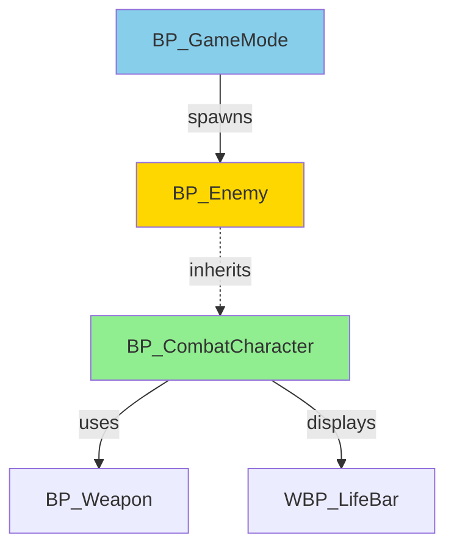
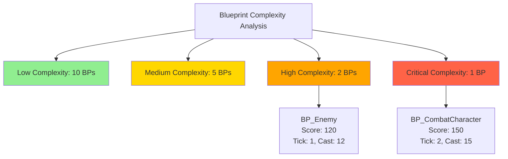
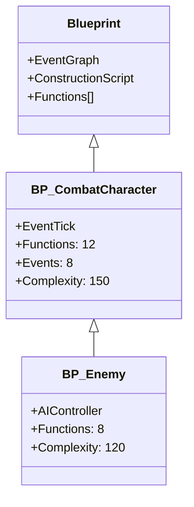

# UE Blueprint Analyzer

Advanced Blueprint analysis and optimization tool for Unreal Engine 5 projects.

## Overview

The UE Blueprint Analyzer is a comprehensive AgentSkill that analyzes Blueprint assets to identify quality issues, performance bottlenecks, and best practice violations. It provides actionable recommendations for improving Blueprint design and performance.

## Features

### 1. Blueprint Dependency Analysis
- **Reference Mapping**: Map all Blueprint-to-Blueprint references
- **Circular Dependency Detection**: Identify circular dependencies that can cause issues
- **Dependency Graph Visualization**: Generate Mermaid diagrams showing dependency relationships
- **Asset Hierarchy**: Understand parent-child relationships between Blueprints

### 2. Performance Analysis
- **Tick Usage Detection**: Identify EventTick usage and suggest Timer-based alternatives
- **Cast Operation Analysis**: Detect excessive Cast operations and recommend interface usage
- **ForEach Loop Detection**: Find expensive loop operations and suggest optimizations
- **Heavy Operation Detection**: Identify computationally expensive operations:
  - String concatenation in loops
  - Array operations in frequently-called functions
  - Construction Script complexity
- **Event Graph Complexity**: Measure complexity of Event Graphs and Functions

### 3. Best Practice Checks
- **Naming Convention Validation**: Ensure proper prefixes (BP_, WBP_, etc.)
- **Unused Node Detection**: Find unused variables, functions, and events
- **Magic Number Detection**: Identify hardcoded values that should be variables
- **Comment Coverage**: Check for adequate documentation
- **Event Dispatcher Usage**: Validate proper Event Dispatcher patterns
- **Interface Recommendations**: Suggest where interfaces should be used instead of casts

### 4. Optimization Suggestions
- **Interface Usage**: Recommend implementing interfaces for polymorphism
- **Event Dispatcher Optimization**: Suggest Event Dispatcher patterns for decoupling
- **Function Extraction**: Identify code that should be extracted into functions
- **Timer vs Tick**: Recommend Timer usage instead of EventTick
- **Blueprint Nativization**: Suggest C++ migration for performance-critical code

## Usage

### Quick Start

```bash
# Analyze all Blueprints in the project
./scripts/analyze-blueprints.sh --full-analysis

# Analyze a specific folder
./scripts/analyze-blueprints.sh --path Content/Variant_Combat/Blueprints

# Performance analysis only
./scripts/analyze-blueprints.sh --performance

# Generate dependency graph
./scripts/analyze-blueprints.sh --diagram
```

### Command Options

#### Phase 1: Filesystem-based Analysis
```bash
# Full filesystem analysis
./scripts/analyze-blueprints.sh

# Specific path
./scripts/analyze-blueprints.sh --path Content/Variant_Combat

# By asset type
./scripts/analyze-blueprints.sh --type blueprints
./scripts/analyze-blueprints.sh --type ui
./scripts/analyze-blueprints.sh --type materials

# Generate Mermaid diagrams
./scripts/analyze-blueprints.sh --diagram
```

#### Phase 3: Performance Analysis
```bash
# Run performance checks
./scripts/analyze-blueprints.sh --performance

# Full analysis (Phase 1 + Phase 3)
./scripts/analyze-blueprints.sh --full-analysis

# Save report to file
./scripts/analyze-blueprints.sh --full-analysis --output blueprint-report.md

# Analyze specific metrics
./scripts/analyze-blueprints.sh --performance --metrics tick,cast,loops

# CI/CD integration - fail on critical issues
./scripts/analyze-blueprints.sh --performance --fail-on-critical
```

### Integration with Claude Code

When working with Claude Code, you can invoke this skill using:

```
User: "Analyze the Blueprints in Variant_Combat"
User: "Check BP_CombatCharacter for performance issues"
User: "Generate a Blueprint dependency map"
User: "Find all Blueprints using EventTick"
```

Claude will automatically:
1. Run the appropriate analysis commands
2. Parse the results
3. Provide recommendations
4. Generate visualizations if needed

## Output Examples

### 1. Statistics Summary
```
Blueprint Analysis Report
========================

Total Assets: 150
- Blueprints (BP_*): 45
- UI Widgets (WBP_*): 12
- Materials (M_*): 30
- Material Instances (MI_*): 25
- Input Actions (IA_*): 10
- Other: 28

By Variant:
- Variant_Combat: 80
- Variant_SideScrolling: 20
- Variant_Platforming: 15
- Core/Shared: 35
```

### 2. Performance Report
```markdown
## Performance Analysis Report

### Critical Issues (Must Fix)
- ❌ **BP_CombatCharacter**: EventTick used 2 times (Complexity Score: 150)
  - Location: Event Graph
  - Impact: High CPU usage every frame
  - 💡 **Suggestion**: Replace EventTick with Timers. Use `SetTimerByFunctionName` for periodic updates
  - Example:
    ```
    // Instead of EventTick, use:
    SetTimerByFunctionName("UpdateHealth", 0.1, true)
    ```

- ❌ **BP_Enemy**: 15 Cast operations detected
  - Location: Event Graph, BeginPlay
  - Impact: Type checking overhead
  - 💡 **Suggestion**: Implement ICombatInterface instead of casting
  - Example:
    ```
    // Instead of: Cast to BP_Character
    // Use: Call Interface ICombatInterface
    ```

### Warnings (Should Review)
- ⚠️ **BP_GameMode**: ForEach loop used 5 times
  - Location: Event Graph, Function: SpawnEnemies
  - Impact: Potential performance issue if array is large
  - 💡 **Suggestion**: Consider using indexed loops or breaking into smaller chunks

- ⚠️ **BP_UIManager**: Construction Script complexity: 85
  - Impact: Slow editor performance when selecting Blueprint
  - 💡 **Suggestion**: Move initialization logic to BeginPlay

### Info (Best Practices)
- ℹ️ **BP_Weapon**: 3 magic numbers detected
  - Location: Function: CalculateDamage
  - 💡 **Suggestion**: Extract to variables: BaseDamage, CriticalMultiplier, etc.
```

### 3. Naming Convention Issues
```
Naming Convention Violations:
- NewBlueprint.uasset (Content/) - Missing BP_ prefix
  → Recommended: BP_NewBlueprint.uasset

- MyCharacter.uasset (Content/Variant_Combat/) - Should use BP_ prefix
  → Recommended: BP_MyCharacter.uasset

- LifeBarWidget.uasset (Content/Variant_Combat/UI/) - UI widgets should use WBP_ prefix
  → Recommended: WBP_LifeBar.uasset
```

### 4. Dependency Analysis
```
Blueprint Dependencies:
├── BP_CombatCharacter
│   ├── References: BP_Weapon, BP_HealthComponent, WBP_LifeBar
│   └── Referenced by: BP_PlayerCharacter, BP_Enemy
├── BP_GameMode
│   ├── References: BP_PlayerController, BP_PlayerState
│   └── Referenced by: None (Root level)
└── ⚠️ Circular Dependency Detected:
    BP_Character → BP_Weapon → BP_Character
```

### 5. Optimization Recommendations
```
Top Optimization Opportunities:

1. **High Priority - EventTick Replacement**
   - BP_CombatCharacter (Score: 150)
   - BP_Enemy (Score: 120)
   - Potential FPS improvement: 15-20%

2. **Medium Priority - Interface Implementation**
   - BP_Enemy: Replace 15 Cast operations with ICombatInterface
   - BP_Interactable: Replace 8 Cast operations with IInteractInterface
   - Potential performance gain: 5-10%

3. **Low Priority - Function Extraction**
   - BP_GameMode::SpawnEnemies: Extract spawn logic into separate functions
   - BP_Character::UpdateHealthBar: Extract UI update logic
   - Improves: Maintainability, reusability
```

### 6. Mermaid Diagrams

#### Dependency Graph


#### Complexity Visualization


#### Class Hierarchy


## Analysis Phases

### Phase 1: Filesystem-based Analysis (✅ Implemented)
**No UE5 Editor Required** - Runs in CI/CD

- Naming convention validation
- Folder structure analysis
- Asset categorization and counting
- Basic dependency inference from file paths
- Mermaid diagram generation

**Capabilities:**
- Fast and lightweight
- CI/CD compatible
- No external dependencies
- Analyzes project organization

### Phase 2: Unreal Python API Integration (⚠️ Requires UE Editor)
**Requires UE5 Editor Running**

- Node count extraction
- Function and event counting
- Event Graph complexity measurement
- Blueprint asset metadata extraction
- Actual dependency relationship extraction

**Capabilities:**
- Detailed Blueprint internals
- Accurate metrics
- Deep analysis

**Status:** Framework ready, requires Unreal Editor environment

### Phase 3: Advanced Performance Analysis (✅ Implemented)
**Python-based, No Editor Required**

- Tick usage detection
- Cast operation analysis
- ForEach loop detection
- String operation complexity
- Construction Script analysis
- Memory usage estimation
- Complexity scoring
- Best practices validation

**Capabilities:**
- Performance bottleneck identification
- Actionable optimization suggestions
- Issue severity classification
- CI/CD integration with failure conditions

## Configuration

Configuration file: `Config/BlueprintAnalyzer.ini`

```ini
[Performance]
MaxTickUsage=5
MaxCastPerBlueprint=10
MaxLoopDepth=3
WarnOnConstructionScriptComplexity=true
ConstructionScriptComplexityThreshold=50
MaxForEachLoops=5
MaxStringOperations=10

[Memory]
MaxArrayMapCount=20
WarnOnLargeAssetReferences=true
MaxObjectReferences=50

[BestPractices]
CheckEventDispatcherUsage=true
CheckFunctionDesign=true
RequireComments=true
DetectMagicNumbers=true
CheckNamingConsistency=true

[Documentation]
GenerateMermaid=true
IncludePrivateFunctions=false
OutputFormat=markdown
GenerateClassHierarchy=true
GenerateDependencyMap=true
GenerateImprovementReport=true

[Scoring]
TickEventWeight=10
ForEachLoopWeight=5
CastWeight=2
StringOperationWeight=3
ArrayOperationWeight=2
LowComplexityThreshold=50
MediumComplexityThreshold=100
HighComplexityThreshold=150

[CI]
FailOnCritical=false
FailOnWarnings=false
MaxCriticalIssues=0
MaxWarnings=10
```

## Technical Implementation

### Tools Used
- **Read**: `.uasset` file metadata reading
- **Bash**: File system operations, `find`, `grep`
- **Grep**: Pattern matching in Blueprint files
- **Glob**: Blueprint file enumeration
- **Python**: Advanced analysis (blueprint_performance_analyzer.py)

### Architecture
```
.claude/commands/ue-blueprint-analyzer.md  # This AgentSkill definition
scripts/analyze-blueprints.sh              # Main analysis script
Plugins/BlueprintAnalyzer/                 # Analyzer plugin
  └── Content/Python/
      └── blueprint_performance_analyzer.py # Python analyzer module
Config/BlueprintAnalyzer.ini               # Configuration file
```

### Complexity Scoring Algorithm
```python
complexity_score = (
    tick_events * TickEventWeight +
    foreach_loops * ForEachLoopWeight +
    cast_operations * CastWeight +
    string_operations * StringOperationWeight +
    array_operations * ArrayOperationWeight
)

if complexity_score < 50: return "Low"
elif complexity_score < 100: return "Medium"
elif complexity_score < 150: return "High"
else: return "Critical"
```

## CI/CD Integration

### GitHub Actions Example
```yaml
- name: Analyze Blueprints
  run: |
    ./scripts/analyze-blueprints.sh --performance --fail-on-critical --output blueprint-report.md

- name: Upload Report
  if: always()
  uses: actions/upload-artifact@v3
  with:
    name: blueprint-analysis
    path: blueprint-report.md
```

### Exit Codes
- `0`: Analysis completed, no critical issues
- `1`: Critical issues found (when using `--fail-on-critical`)
- `2`: Analysis failed (invalid arguments, file not found, etc.)

## Use Cases

### 1. Code Review
```
Developer: "@claude please analyze BP_NewFeature for performance issues"
```
Claude will run the analyzer and provide a detailed report with specific recommendations.

### 2. Refactoring
```
Developer: "I want to optimize BP_CombatCharacter, what should I focus on?"
```
Claude will analyze the Blueprint and prioritize optimizations by impact.

### 3. Dependency Investigation
```
Developer: "Why is BP_Weapon being loaded when I open BP_Character?"
```
Claude will generate a dependency graph showing the reference chain.

### 4. Best Practice Validation
```
Developer: "Check all Blueprints in Variant_Combat for naming issues"
```
Claude will run Phase 1 analysis and report naming violations.

### 5. Performance Audit
```
Developer: "Find all Blueprints using EventTick in the project"
```
Claude will run Phase 3 analysis and list all Tick usage with recommendations.

## Related Documentation

- [Blueprint Best Practices (UE5)](https://docs.unrealengine.com/5.7/blueprint-best-practices-in-unreal-engine/)
- [Blueprint Performance Guide](https://docs.unrealengine.com/5.7/blueprint-technical-guide/)
- [Project Documentation](../../CLAUDE.md)
- [Plugin README](../../Plugins/BlueprintAnalyzer/README.md)
- [Phase 3 Implementation Details](../../Plugins/BlueprintAnalyzer/Documentation/Phase3-Implementation.md)

## Extending the Analyzer

To add custom checks:

1. Edit `Plugins/BlueprintAnalyzer/Content/Python/blueprint_performance_analyzer.py`
2. Add a new analyzer method:

```python
def analyze_custom_check(self, metrics: BlueprintMetrics):
    """Your custom analysis logic"""
    if metrics.some_metric > threshold:
        issue = PerformanceIssue(
            level=IssueLevel.WARNING,
            blueprint_name=metrics.name,
            issue_type="Custom Check",
            description="Issue description",
            suggestion="Recommendation"
        )
        metrics.issues.append(issue)
```

3. Call it from `analyze_blueprint()`:

```python
def analyze_blueprint(self, metrics: BlueprintMetrics):
    # ... existing analyzers ...
    self.analyze_custom_check(metrics)
    return metrics
```

4. Update configuration in `Config/BlueprintAnalyzer.ini` if needed

## Limitations

- **Phase 2**: Requires Unreal Editor with Python API enabled
- **Binary Files**: Cannot read .uasset internals without UE5 API
- **Runtime Analysis**: Static analysis only, no runtime profiling
- **Nativized Blueprints**: Does not analyze nativized code

## Troubleshooting

### Analyzer Not Found
```bash
# Verify script exists and is executable
ls -la scripts/analyze-blueprints.sh
chmod +x scripts/analyze-blueprints.sh
```

### Python Module Issues
```bash
# Verify Python 3 is installed
python3 --version

# Check if analyzer module exists
ls -la Plugins/BlueprintAnalyzer/Content/Python/blueprint_performance_analyzer.py
```

### Configuration Not Loaded
```bash
# Verify config file exists
cat Config/BlueprintAnalyzer.ini
```

### Permission Denied
```bash
# Make script executable
chmod +x scripts/analyze-blueprints.sh
```

## Version History

- **v1.0** - Phase 1: Filesystem-based analysis
- **v2.0** - Phase 3: Advanced performance analysis
- **v3.0** - (Future) Phase 2: Unreal Python API integration

---

**AgentSkill**: ue-blueprint-analyzer
**Category**: Analysis & Quality
**Platform**: Unreal Engine 5.7
**Status**: Production Ready (Phase 1 & 3)

Generated with [Claude Code](https://claude.com/claude-code)
