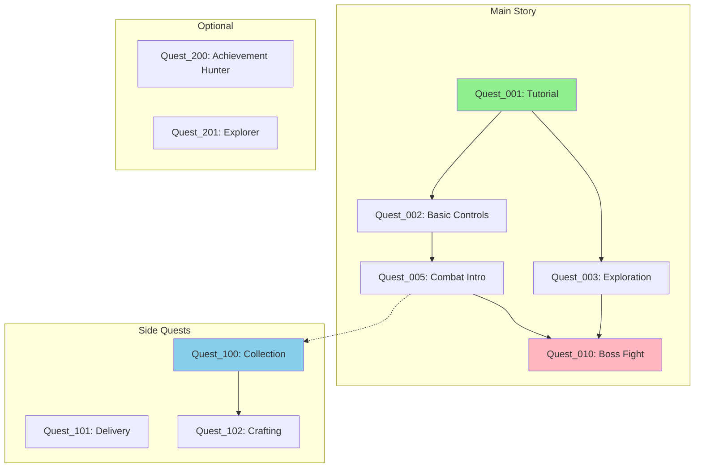

# UE Quest Validator

Validate Quest System data integrity, detect issues, and ensure quest design quality in Unreal Engine projects.

## Overview

This skill checks quest data consistency, dependency validation, flow analysis, achievability verification, and balance adjustment suggestions for QuestSystem plugin.

## Purpose

- Quest data quality assurance
- Early bug detection
- Quest design validation
- Playability assurance

## Key Features

### 1. Quest Data Integrity Checks
- Validate required fields
- Check for duplicate IDs
- Verify prerequisite validity
- Validate reward settings

### 2. Dependency Validation
- Detect circular dependencies
- Find references to non-existent quests
- Identify impossible prerequisites
- Detect dead-end quests

### 3. Progress Flow Analysis
- Visualize quest chains
- Verify branching patterns
- Confirm paths to endgame
- Identify required/optional quests

### 4. Achievability Verification
- Check objective feasibility
- Verify required items/NPCs exist
- Validate location information
- Check time limit appropriateness

### 5. Balance Adjustment Suggestions
- Check reward appropriateness
- Estimate difficulty
- Estimate completion time
- Validate player level requirements

## Instructions

This command performs comprehensive validation of QuestSystem data.

### Analysis Steps

1. **Locate Quest Data**
   - Search for QuestSystem plugin: `Plugins/QuestSystem/`
   - Find quest data files (`.uasset`, `.cpp`, `.h`)
   - Identify quest configuration files

2. **Load Quest Data**
   - Parse quest definitions from C++ headers
   - Read Blueprint quest assets
   - Extract quest metadata from Content directory
   - Build quest database

3. **Execute Integrity Checks**
   - Validate quest ID uniqueness
   - Check required fields (ID, Name, Description)
   - Verify data type correctness
   - Check for null/invalid references

4. **Validate Dependencies**
   - Build dependency graph
   - Detect circular dependencies using DFS
   - Verify all referenced quests exist
   - Check prerequisite achievability
   - Identify orphaned quests

5. **Analyze Flow**
   - Trace quest chains from start to end
   - Map branching paths
   - Identify critical path quests
   - Categorize quests (main story, side quests, optional)

6. **Verify Achievability**
   - Check if required items exist in game
   - Verify NPC references are valid
   - Validate location coordinates
   - Check time limits are reasonable

7. **Generate Report**
   - Compile errors (critical issues)
   - List warnings (recommended fixes)
   - Provide info messages (optimization suggestions)
   - Generate quest graph visualization
   - Suggest improvements

## Validation Checks

### Required Checks (Errors)
- [ ] Quest ID uniqueness
- [ ] Required fields present (ID, Name, Description, Objectives)
- [ ] Prerequisite quest exists
- [ ] No circular dependencies
- [ ] No invalid references (items, NPCs, locations)
- [ ] Objective types are valid
- [ ] Reward types are valid

### Recommended Checks (Warnings)
- [ ] Description text present
- [ ] Rewards configured
- [ ] Difficulty level set
- [ ] Category assigned
- [ ] Icon assigned
- [ ] Completion time estimate provided
- [ ] Player level requirement set

### Optimization Checks (Info)
- [ ] Isolated quest chains
- [ ] Overly long quest chains (>10 quests)
- [ ] Branching complexity (>5 branches)
- [ ] Balance adjustment suggestions
- [ ] Missing localization strings
- [ ] Unused quest objectives

## Expected Output

### 1. Summary Statistics
```
Quest Validation Report
=======================

Summary:
- Total Quests: 45
- Errors: 3
- Warnings: 8
- Info: 5

Quest Categories:
- Main Story: 15
- Side Quests: 20
- Optional: 10
```

### 2. Error Report
```
ERRORS (Critical - Must Fix):

[E001] Circular Dependency Detected
  Quest_003 → Quest_015 → Quest_020 → Quest_003
  Impact: Quest chain cannot be completed
  Fix: Remove one prerequisite link to break the cycle

[E002] Invalid Quest Reference
  Quest_042 references non-existent prerequisite: Quest_999
  Location: Plugins/QuestSystem/Content/Quests/BP_Quest_042.uasset
  Fix: Update prerequisite or create Quest_999

[E003] Duplicate Quest ID
  Quest ID "QUEST_BOSS_01" used by both:
    - Quest_025 (Content/Quests/MainStory/BP_Quest_025.uasset)
    - Quest_018 (Content/Quests/SideQuests/BP_Quest_018.uasset)
  Fix: Rename one quest ID to be unique
```

### 3. Warning Report
```
WARNINGS (Recommended Fixes):

[W001] Missing Description
  Quests without descriptions: Quest_010, Quest_023, Quest_031
  Impact: Players won't understand quest purpose
  Recommendation: Add description text for quest clarity

[W002] Missing Rewards
  Quests without rewards: Quest_007, Quest_019
  Impact: Reduced player motivation
  Recommendation: Add appropriate rewards

[W003] Unbalanced Difficulty
  Quest_042 (Difficulty: 8) requires Quest_005 (Difficulty: 2)
  Impact: Sudden difficulty spike
  Recommendation: Add intermediate quests or adjust difficulty
```

### 4. Quest Graph Visualization


### 5. Info Messages
```
INFORMATION (Optimization Suggestions):

[I001] Isolated Quest Chain
  Quest_150 → Quest_151 → Quest_152 has no connection to main story
  Suggestion: Link to main quest chain or make clearly optional

[I002] Long Quest Chain
  Main story chain has 15 sequential quests
  Suggestion: Consider adding parallel paths or optional shortcuts

[I003] Complex Branching
  Quest_025 has 7 different prerequisite paths
  Suggestion: Simplify dependency structure for clarity
```

### 6. Recommendations
```
Recommended Actions:

CRITICAL (Fix Before Release):
1. Resolve circular dependency: Quest_003 → Quest_015 → Quest_020
2. Fix invalid reference in Quest_042 to Quest_999
3. Rename duplicate Quest ID in Quest_025 or Quest_018

HIGH PRIORITY:
4. Add descriptions to 3 quests (Quest_010, Quest_023, Quest_031)
5. Add rewards to 2 quests (Quest_007, Quest_019)

MEDIUM PRIORITY:
6. Connect isolated quest chain (Quest_150-152) to main story
7. Balance difficulty progression between Quest_005 and Quest_042

LOW PRIORITY:
8. Consider simplifying Quest_025 prerequisite structure
9. Add parallel paths to long main story chain
```

## Usage Examples

### Full Validation
```
User: "Validate all quests in the system"
→ Performs comprehensive validation and generates full report
```

### Specific Quest Analysis
```
User: "Check Quest_MainStory_05 dependencies"
→ Analyzes specific quest's prerequisites and dependents
→ Shows dependency graph for that quest
```

### Find Specific Issues
```
User: "Find unachievable quests"
→ Checks objective feasibility for all quests
→ Reports quests with missing items, NPCs, or locations
```

### Balance Check
```
User: "Check quest balance and difficulty"
→ Analyzes reward-to-difficulty ratios
→ Identifies difficulty spikes
→ Suggests rebalancing
```

## Implementation Notes

### Tools Used
- **Glob**: Find quest asset files (`**/*Quest*.uasset`, `**/QuestSystem/**/*.h`)
- **Grep**: Search for quest references and IDs
- **Read**: Parse quest data structures from C++ headers
- **Bash**: Use UnrealEditor-Cmd for Blueprint data extraction (if available)

### Quest Data Sources

1. **C++ Quest Definitions**
   - Location: `Plugins/QuestSystem/Source/*/Public/QuestData.h`
   - Contains: Quest structure definitions, enums, data types

2. **Blueprint Quest Assets**
   - Location: `Content/Quests/**/*.uasset`
   - Contains: Quest instances with specific data

3. **Quest Configuration**
   - Location: `Config/QuestSystem.ini` (if exists)
   - Contains: Global quest settings

### Dependency Graph Algorithm

```
1. Build adjacency list from quest prerequisites
2. Detect cycles using DFS with color marking:
   - White: Unvisited
   - Gray: Currently visiting (in DFS stack)
   - Black: Fully visited
3. If revisit a gray node → circular dependency detected
4. Build dependency chains by traversing from root quests
5. Identify isolated subgraphs (disconnected components)
```

### Achievability Checks

```
For each quest objective:
1. Parse objective type (Kill, Collect, Talk, Visit, etc.)
2. Extract required references (Enemy_ID, Item_ID, NPC_ID, Location)
3. Verify reference exists in game data:
   - Search for enemy blueprints
   - Check item database
   - Verify NPC exists
   - Validate location coordinates
4. Report missing references as errors
```

## Integration with Project

### QuestSystem Plugin Structure (Expected)
```
Plugins/QuestSystem/
├── Source/
│   └── QuestSystem/
│       ├── Public/
│       │   ├── QuestData.h          # Quest data structures
│       │   ├── QuestManager.h       # Quest management
│       │   └── QuestTypes.h         # Enums and types
│       └── Private/
│           └── QuestManager.cpp     # Implementation
├── Content/
│   └── Quests/
│       ├── MainStory/              # Main quest assets
│       ├── SideQuests/             # Side quest assets
│       └── Optional/               # Optional quest assets
└── Config/
    └── QuestSystem.ini             # Configuration
```

### Data Structure Example (from QuestData.h)

```cpp
USTRUCT(BlueprintType)
struct FQuestData
{
    GENERATED_BODY()

    UPROPERTY(EditAnywhere, BlueprintReadWrite)
    FName QuestID;

    UPROPERTY(EditAnywhere, BlueprintReadWrite)
    FText QuestName;

    UPROPERTY(EditAnywhere, BlueprintReadWrite)
    FText Description;

    UPROPERTY(EditAnywhere, BlueprintReadWrite)
    TArray<FName> Prerequisites;

    UPROPERTY(EditAnywhere, BlueprintReadWrite)
    TArray<FQuestObjective> Objectives;

    UPROPERTY(EditAnywhere, BlueprintReadWrite)
    TArray<FQuestReward> Rewards;

    UPROPERTY(EditAnywhere, BlueprintReadWrite)
    int32 RequiredLevel;

    UPROPERTY(EditAnywhere, BlueprintReadWrite)
    int32 DifficultyRating;
};
```

## Limitations

- Cannot analyze Blueprint-internal quest logic without running UE Editor
- Localization validation limited to checking string table references
- Balance suggestions based on heuristics, not actual playtesting
- Item/NPC existence checks limited to asset naming patterns

## CI/CD Integration

The validator can be integrated into CI/CD pipelines:

```bash
# Run validation in CI
./scripts/validate-quests.sh --strict --output report.json

# Exit with error code if critical issues found
./scripts/validate-quests.sh --fail-on-error
```

## Future Enhancements

- Integration with UE Python API for deeper Blueprint analysis
- Automated quest balance testing with simulated playthroughs
- Localization completeness verification
- Quest narrative flow analysis
- Auto-fix suggestions for common issues
- Integration with version control to track quest changes

## Related Documentation

- See `Plugins/QuestSystem/` for quest data structures (when implemented)
- See `CLAUDE.md` for project coding conventions
- See issue #89 for skill requirements and use cases

## Priority

Medium - Useful for QuestSystem quality improvement (project-specific)
