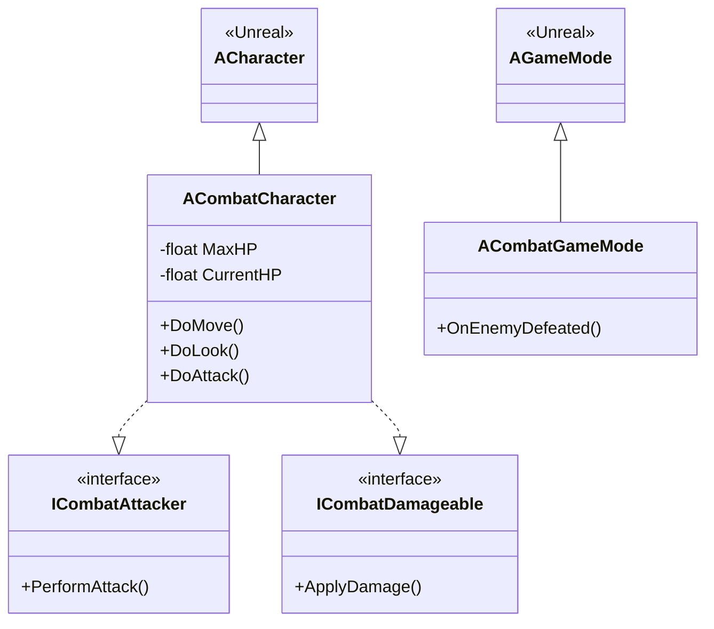
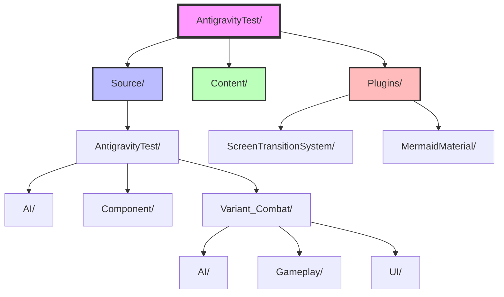
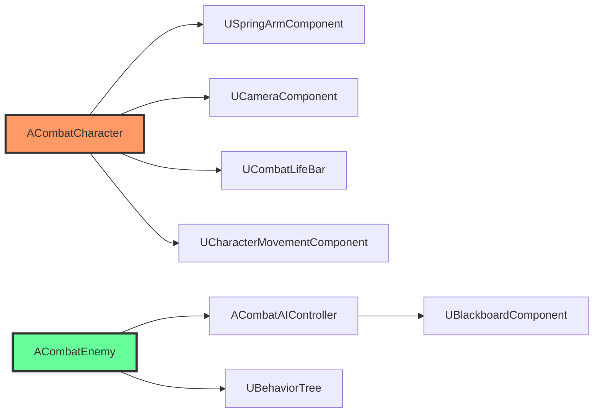

# Generate Mermaid Diagram

Generates Mermaid diagrams from the AntigravityTest Unreal Engine 5 project structure.

## Description

This skill analyzes the project codebase and generates various types of Mermaid diagrams including class hierarchies, folder structures, and flowcharts. It integrates with the existing MermaidMaterial plugin for visualization.

## Supported Diagram Types

### 1. Class Hierarchy (`--type class-hierarchy`)
Generates a class diagram showing C++ class inheritance and Blueprint relationships.

**Options:**
- `--variant <name>`: Filter by variant (Combat, SideScrolling, Platforming, All)
- `--depth <n>`: Maximum inheritance depth to display (default: unlimited)
- `--show-interfaces`: Include interface classes

**Example:**
```
Generate class hierarchy for Combat variant
```

### 2. Folder Structure (`--type folder-tree`)
Generates a tree diagram of the project folder structure.

**Options:**
- `--path <path>`: Starting path (default: project root)
- `--depth <n>`: Maximum depth to display (default: 3)
- `--include-content`: Include Content folder (Blueprints, assets)
- `--include-plugins`: Include Plugins folder

**Example:**
```
Generate folder tree for Content/Variant_Combat
```

### 3. Component Dependencies (`--type component-deps`)
Shows relationships between game components and actors.

**Options:**
- `--focus <class>`: Focus on specific class and its dependencies

**Example:**
```
Generate component dependency diagram for CombatCharacter
```

### 4. GameMode Flow (`--type gamemode-flow`)
Visualizes game mode transitions and relationships.

**Example:**
```
Generate gamemode flow diagram
```

### 5. Interface Implementations (`--type interface-impl`)
Shows which classes implement which interfaces.

**Options:**
- `--interface <name>`: Filter by specific interface

**Example:**
```
Generate interface implementation diagram for Combat interfaces
```

## Instructions

When the user requests a Mermaid diagram:

1. **Parse the request** to determine:
   - Diagram type (class-hierarchy, folder-tree, component-deps, gamemode-flow, interface-impl)
   - Options (variant, path, depth, filters)
   - Output preferences (save to file, display inline, export to MermaidMaterial)

2. **Analyze the codebase**:
   - Use `Glob` to find relevant files (*.h, *.cpp for classes)
   - Use `Grep` to search for class definitions, inheritance, interfaces
   - Use `Read` to parse file contents when needed
   - Build internal representation of relationships

3. **Generate Mermaid syntax**:
   - Create appropriate Mermaid diagram based on type
   - Follow Mermaid best practices for readability
   - Group related items with subgraphs where appropriate
   - Add styling for better visualization

4. **Output the diagram**:
   - Display the Mermaid code in a code block
   - Optionally save to a .mmd or .md file
   - Suggest next steps (copy to MermaidMaterial plugin, export as image)

## Diagram Generation Guidelines

### Class Hierarchy Diagram


### Folder Structure Diagram


### Component Dependencies Diagram


## Tips for Better Diagrams

1. **Keep it focused**: Don't try to visualize the entire codebase at once
2. **Use filters**: Narrow down to specific variants or namespaces
3. **Group logically**: Use subgraphs to group related classes
4. **Add context**: Include key methods/properties for important classes
5. **Color code**: Use styling to differentiate types (Actor, Component, Interface)
6. **Limit depth**: For large hierarchies, limit depth to avoid clutter

## Integration with MermaidMaterial Plugin

After generating a diagram, you can:

1. **Save to file**: Create a .mmd file in the project
2. **Create asset**: Use MermaidMaterial plugin to generate a material graph
3. **Export image**: Render as PNG/SVG for documentation

## Examples

### Example 1: Combat Variant Class Hierarchy
**User request**: "Generate class hierarchy for Combat variant"

**Action**:
1. Search for all .h files in `Source/AntigravityTest/Variant_Combat/`
2. Parse class definitions and inheritance
3. Identify interfaces (ICombatAttacker, ICombatDamageable, ICombatActivatable)
4. Generate classDiagram with inheritance arrows
5. Add interface implementations with dashed arrows

### Example 2: Project Folder Structure
**User request**: "Show me the folder structure for Content/Variant_Combat"

**Action**:
1. Use Bash to list directories: `find Content/Variant_Combat -type d`
2. Build tree structure
3. Generate graph TD diagram
4. Add styling for different folder types

### Example 3: Full Project Overview
**User request**: "Create a complete project structure diagram"

**Action**:
1. Analyze Source/, Content/, Plugins/ directories
2. Show top 2-3 levels only to keep readable
3. Use subgraphs for major sections
4. Add color coding for different areas

## Advanced Features (Future)

- Parse Blueprint metadata to show BP class hierarchies
- Analyze State Trees and generate state diagrams
- Create sequence diagrams from function call chains
- Generate ER diagrams from SaveGame data structures
- Real-time updates when files change
- Interactive diagram editing with MermaidMaterial plugin

## Notes

- This skill focuses on **static analysis** of the codebase
- Blueprint analysis requires parsing .uasset files (limited in text mode)
- For complex diagrams, consider breaking into multiple smaller diagrams
- Always verify generated diagrams represent current codebase state
