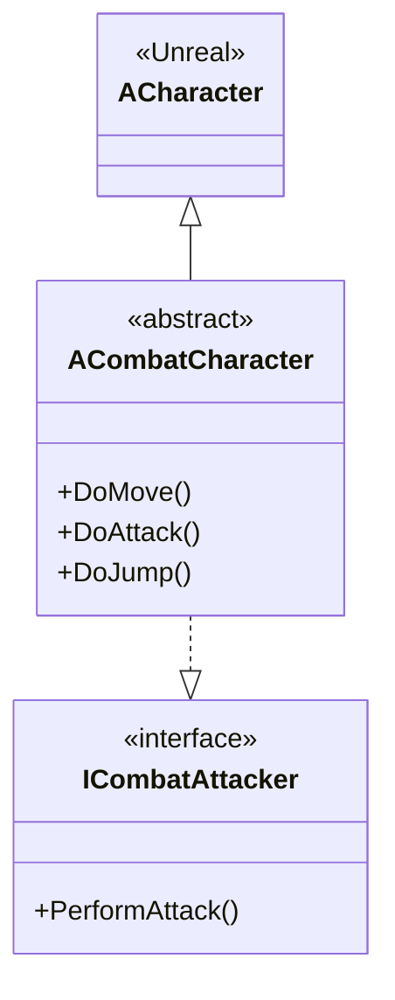

# Mermaid Diagram Generator - Helper Scripts

This directory contains Python helper scripts for advanced Mermaid diagram generation from the AntigravityTest UE5 project.

## Scripts

### class_analyzer.py

Analyzes C++ header files to extract class hierarchies, interfaces, and relationships.

**Usage:**
```bash
# Analyze entire Source directory
python class_analyzer.py ../../../Source/AntigravityTest

# Analyze specific variant
python class_analyzer.py ../../../Source/AntigravityTest Combat

# Example output: Mermaid class diagram
```

**Features:**
- Parses UCLASS and UINTERFACE macros
- Extracts inheritance relationships
- Identifies interface implementations
- Categorizes classes by type (Actor, Component, GameMode, etc.)
- Generates Mermaid classDiagram syntax

**Output:**


## Requirements

- Python 3.7+
- No external dependencies (uses only standard library)

## Integration with Claude Code Skill

These scripts are designed to be called by the `generate-mermaid-diagram` skill to provide detailed code analysis. The skill can:

1. Invoke the Python script with appropriate parameters
2. Parse the output Mermaid diagram
3. Present it to the user
4. Optionally save to a file or integrate with MermaidMaterial plugin

## Future Enhancements

- Blueprint metadata parsing (requires .uasset parsing)
- State Tree analysis for state diagrams
- Sequence diagram generation from function call traces
- Component dependency analysis
- More sophisticated method/property extraction
