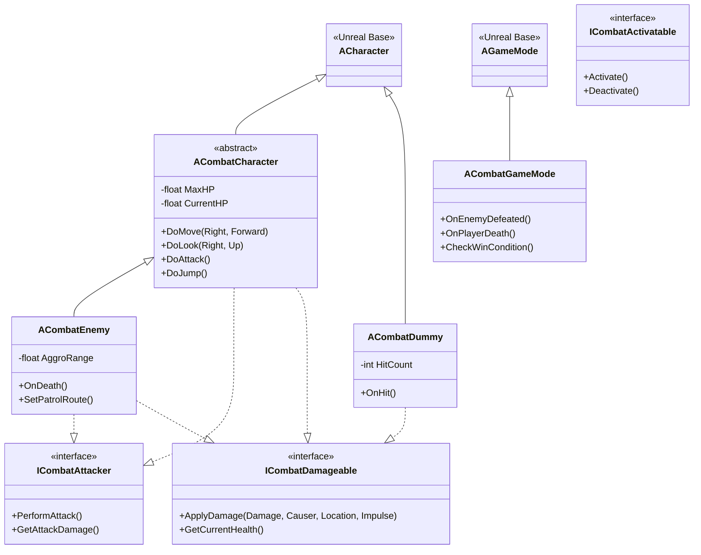
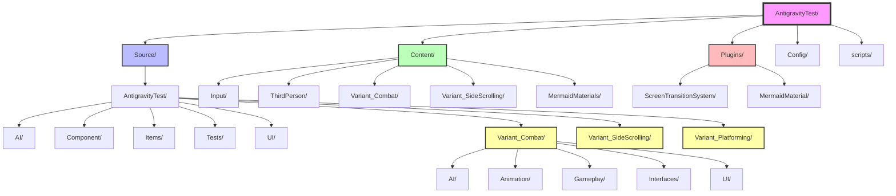
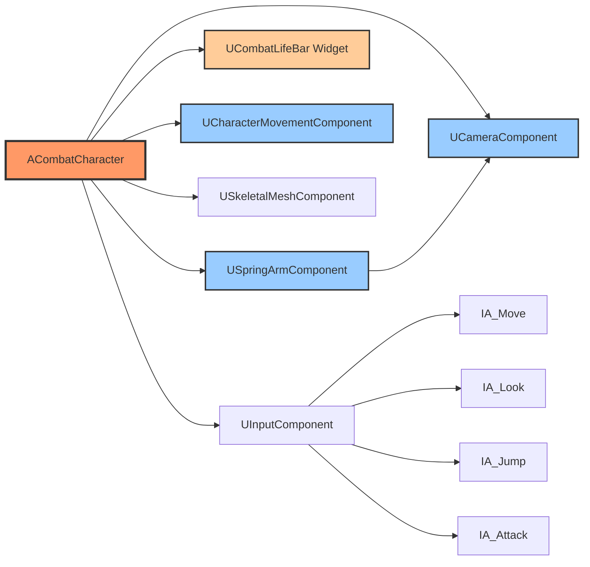
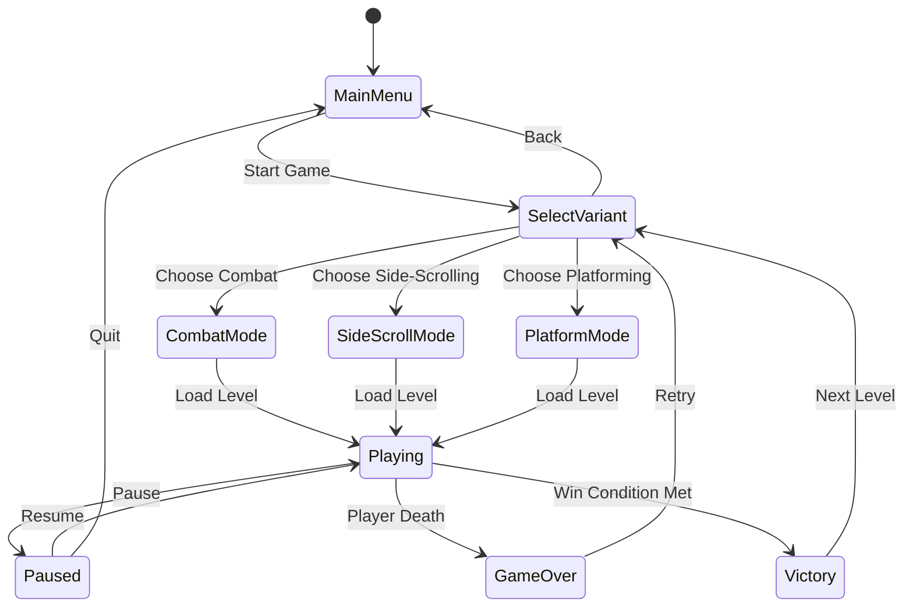
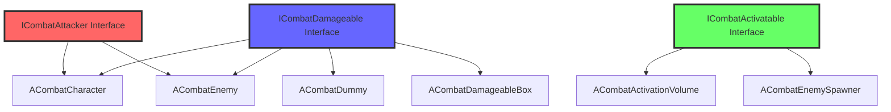
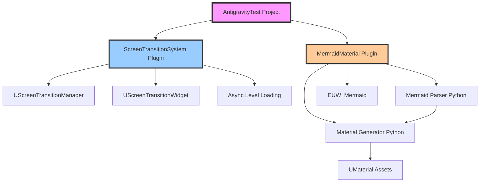
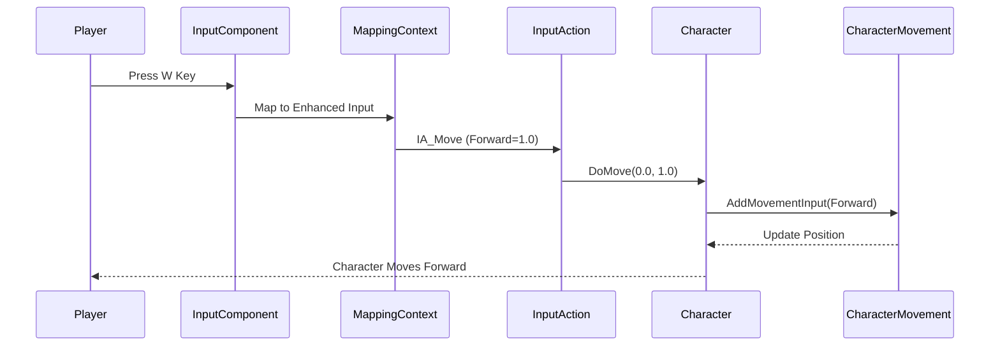

# Mermaid Diagram Generator - Examples

This file contains example Mermaid diagrams that can be generated from the AntigravityTest project.

## Example 1: Combat Variant Class Hierarchy



## Example 2: Project Folder Structure



## Example 3: Combat Character Components



## Example 4: Game Mode Flow



## Example 5: Combat AI System

```mermaid
graph TD
    AIController[ACombatAIController]
    Enemy[ACombatEnemy]
    BehaviorTree[UBehaviorTree]
    Blackboard[UBlackboardComponent]

    AIController --> Enemy
    AIController --> BehaviorTree
    AIController --> Blackboard

    BehaviorTree --> Patrol[Patrol Task]
    BehaviorTree --> Chase[Chase Player Task]
    BehaviorTree --> Attack[Attack Task]
    BehaviorTree --> Flee[Flee Task]

    Blackboard --> TargetPlayer[Target Player]
    Blackboard --> PatrolPoint[Patrol Point]
    Blackboard --> HealthLow[Health Low?]

    Patrol --> Chase: Player Detected
    Chase --> Attack: In Range
    Attack --> Flee: Health Low
    Flee --> Patrol: Health Recovered
    Chase --> Patrol: Lost Player

    style AIController fill:#f96,stroke:#333,stroke-width:3px
    style Enemy fill:#6f9,stroke:#333,stroke-width:3px
    style BehaviorTree fill:#96f,stroke:#333,stroke-width:2px
```

## Example 6: Interface Implementation Map



## Example 7: Plugin Architecture



## Example 8: Input System Flow



## How to Use These Examples

1. **Copy to clipboard**: Select and copy any diagram above
2. **Test in Mermaid Live Editor**: Paste at https://mermaid.live to visualize
3. **Save to file**: Create a .md or .mmd file with the diagram
4. **Integrate with MermaidMaterial**: Use the plugin to generate UE5 material graphs
5. **Include in documentation**: Embed in project README or design docs

## Customization Tips

- **Colors**: Use `style NodeName fill:#color` to customize node colors
- **Shapes**: Different shapes for different node types (rectangles, circles, diamonds)
- **Subgraphs**: Group related items with `subgraph` blocks
- **Icons**: Add icons or emojis for visual appeal (use sparingly in UE projects)
- **Links**: Add clickable links to documentation or source files
