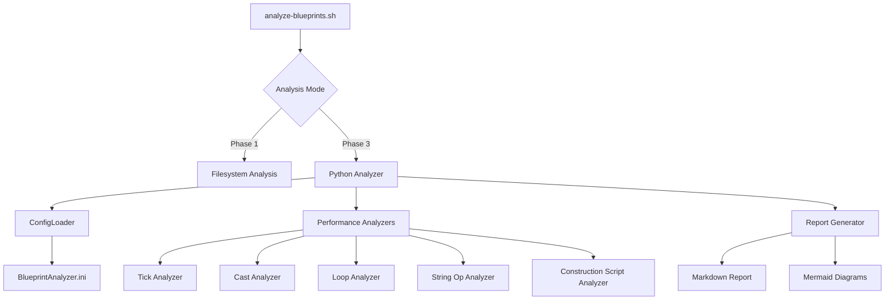
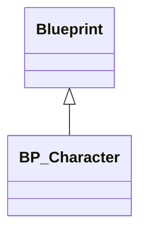
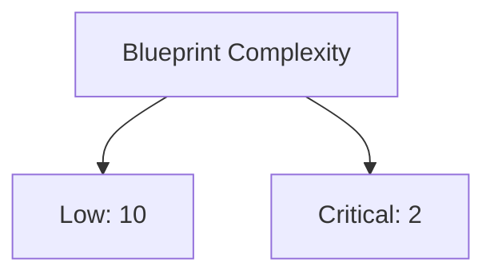

# Blueprint Analyzer - Phase 3 Implementation Guide

## Overview

Phase 3 of the Blueprint Analyzer adds advanced performance analysis capabilities to the existing filesystem-based analysis (Phase 1). This document describes the implementation, architecture, and usage of Phase 3 features.

## Architecture

### Component Overview



### File Structure

```
Project/
├── Config/
│   └── BlueprintAnalyzer.ini              # Configuration file
├── Plugins/
│   └── BlueprintAnalyzer/
│       ├── BlueprintAnalyzer.uplugin      # Plugin descriptor
│       ├── Content/
│       │   └── Python/
│       │       └── blueprint_performance_analyzer.py
│       ├── Documentation/
│       │   └── Phase3-Implementation.md   # This file
│       └── README.md
└── scripts/
    └── analyze-blueprints.sh              # Extended with Phase 3 support
```

## Key Components

### 1. Configuration System

The configuration system uses INI format for easy editing and version control.

**File**: `Config/BlueprintAnalyzer.ini`

**Sections**:
- `[Performance]`: Thresholds for performance checks
- `[Memory]`: Memory usage limits
- `[BestPractices]`: Best practice check flags
- `[Documentation]`: Report generation options
- `[Scoring]`: Complexity score weights
- `[CI]`: CI/CD integration settings

**Example Configuration**:
```ini
[Performance]
MaxTickUsage=5
MaxCastPerBlueprint=10

[Scoring]
TickEventWeight=10
CastWeight=2
```

### 2. Python Analyzer Module

**File**: `Plugins/BlueprintAnalyzer/Content/Python/blueprint_performance_analyzer.py`

**Key Classes**:

#### `ConfigLoader`
- Loads and parses INI configuration
- Provides default values if config is missing
- Type conversion (bool, int, string)

#### `BlueprintMetrics`
- Data class for Blueprint metrics
- Stores counts for various operation types
- Maintains list of issues found

#### `PerformanceIssue`
- Represents a single issue
- Has severity level (Info, Warning, Critical)
- Includes description and suggestion

#### `BlueprintPerformanceAnalyzer`
- Main analyzer class
- Runs individual analysis checks
- Calculates complexity scores
- Generates reports and diagrams

### 3. Analysis Checks

#### Tick Usage Analysis
```python
def analyze_tick_usage(self, metrics: BlueprintMetrics):
    """Detect EventTick usage and warn about performance impact"""
    if metrics.tick_event_count > max_threshold:
        # Create critical issue
        # Suggest using Timers instead
```

**Rationale**: EventTick runs every frame, causing performance issues when overused.

#### Cast Operation Analysis
```python
def analyze_cast_usage(self, metrics: BlueprintMetrics):
    """Detect excessive Cast operations"""
    if metrics.cast_count > max_threshold:
        # Warn about cast overhead
        # Suggest using interfaces
```

**Rationale**: Cast operations have runtime overhead. Interfaces are more efficient.

#### Loop Usage Analysis
```python
def analyze_loop_usage(self, metrics: BlueprintMetrics):
    """Detect ForEach loops in performance-critical code"""
    if metrics.foreach_loop_count > max_threshold:
        # Warn about loop performance
        # Suggest caching or optimization
```

**Rationale**: ForEach loops on large arrays can be expensive, especially in Tick events.

#### String Operation Analysis
```python
def analyze_string_operations(self, metrics: BlueprintMetrics):
    """Detect frequent string operations"""
    if metrics.string_operation_count > max_threshold:
        # Warn about string allocation
        # Suggest caching strings
```

**Rationale**: String operations involve memory allocation and are expensive.

#### ConstructionScript Analysis
```python
def analyze_construction_script(self, metrics: BlueprintMetrics):
    """Analyze ConstructionScript complexity"""
    if metrics.construction_script_complexity > threshold:
        # Critical warning
        # Suggest moving to BeginPlay
```

**Rationale**: Heavy ConstructionScripts slow down the editor and level loading.

### 4. Complexity Scoring

The complexity score is calculated using weighted metrics:

```python
score = 0
score += tick_event_count * TickEventWeight
score += foreach_loop_count * ForEachLoopWeight
score += cast_count * CastWeight
score += string_operation_count * StringOperationWeight
score += array_operation_count * ArrayOperationWeight
```

**Default Weights**:
- Tick Events: 10 (highest impact)
- ForEach Loops: 5
- String Operations: 3
- Cast Operations: 2
- Array Operations: 2

**Complexity Thresholds**:
- **Low**: < 50
- **Medium**: 50-100
- **High**: 100-150
- **Critical**: > 150

### 5. Report Generation

#### Markdown Report
- Grouped by severity (Critical, Warning, Info)
- Includes suggestions for each issue
- Summary statistics
- Top complexity offenders

#### Mermaid Diagrams

**Class Hierarchy Diagram**:


**Complexity Visualization**:


### 6. Shell Script Integration

**File**: `scripts/analyze-blueprints.sh`

**New Flags**:
- `--performance`: Enable Phase 3 analysis
- `--full-analysis`: Run all phases
- `--output <file>`: Save report to file
- `--fail-on-critical`: Exit with error if critical issues found
- `--metrics <list>`: Filter specific metrics

**Workflow**:
1. Run Phase 1 (filesystem analysis)
2. If `--performance` flag set:
   - Check for Python analyzer
   - Run Python script with config
   - Capture output
   - Exit with error if critical issues and `--fail-on-critical`

## Usage Examples

### Basic Performance Analysis

```bash
./scripts/analyze-blueprints.sh --performance
```

**Output**:
```
═════════════════════════════════════════════════════════
  Phase 3: Performance Analysis
═════════════════════════════════════════════════════════

Running Python-based performance analyzer...

## Performance Analysis Report

### Critical Issues
- ❌ BP_CombatCharacter: EventTick used 2 times (Score: 150)
  - 💡 Consider using Timers instead of EventTick
```

### Full Analysis with Report

```bash
./scripts/analyze-blueprints.sh --full-analysis --output report.md
```

Generates:
- Phase 1: Naming conventions, folder structure
- Phase 3: Performance analysis, complexity scores
- Mermaid diagrams
- Improvement recommendations
- Saved to `report.md`

### CI/CD Integration

```bash
#!/bin/bash
# .github/workflows/blueprint-analysis.yml

- name: Analyze Blueprints
  run: |
    ./scripts/analyze-blueprints.sh --performance --fail-on-critical --output blueprint-report.md

- name: Upload Report
  uses: actions/upload-artifact@v3
  with:
    name: blueprint-analysis
    path: blueprint-report.md
```

### Custom Metrics

```bash
./scripts/analyze-blueprints.sh --performance --metrics tick,cast
```

Only analyzes Tick usage and Cast operations.

## Extending Phase 3

### Adding New Analysis Checks

1. **Add Configuration**:
```ini
# Config/BlueprintAnalyzer.ini
[Performance]
MaxCustomMetric=10
```

2. **Create Analyzer Method**:
```python
def analyze_custom_metric(self, metrics: BlueprintMetrics):
    """Analyze custom metric"""
    threshold = self.config.get('Performance', 'MaxCustomMetric', 10)

    if metrics.custom_metric_count > threshold:
        issue = PerformanceIssue(
            level=IssueLevel.WARNING,
            blueprint_name=metrics.name,
            issue_type="Custom Metric",
            description=f"Custom metric: {metrics.custom_metric_count}",
            suggestion="Optimize custom metric usage"
        )
        metrics.issues.append(issue)
```

3. **Register in `analyze_blueprint()`**:
```python
def analyze_blueprint(self, metrics: BlueprintMetrics) -> BlueprintMetrics:
    # ... existing analyzers ...
    self.analyze_custom_metric(metrics)
    return metrics
```

### Adding New Diagram Types

```python
def _generate_custom_diagram(self) -> str:
    """Generate custom Mermaid diagram"""
    diagram = ["```mermaid", "graph TD"]
    # ... diagram generation logic ...
    diagram.append("```")
    return "\n".join(diagram)
```

Then call from `generate_mermaid_diagram()`:
```python
elif diagram_type == "custom":
    return self._generate_custom_diagram()
```

## Phase 2 Integration Plan

Phase 3 is designed to work with Phase 2 (Unreal Python API integration) when implemented.

**Current**: Metrics are manually created or hardcoded for demonstration.

**Phase 2**: Metrics will be extracted from actual Blueprint assets:

```python
import unreal

def extract_blueprint_metrics(blueprint_path: str) -> BlueprintMetrics:
    """Extract metrics from actual Blueprint using Unreal Python API"""
    asset_registry = unreal.AssetRegistryHelpers.get_asset_registry()
    blueprint_asset = asset_registry.get_asset_by_object_path(blueprint_path)
    blueprint = blueprint_asset.get_asset()

    metrics = BlueprintMetrics(
        name=blueprint.get_name(),
        path=blueprint_path
    )

    # Extract actual node counts
    # Count Tick events, Cast nodes, ForEach loops, etc.
    # ...

    return metrics
```

This will enable:
- Automatic scanning of all Blueprints
- Accurate metric extraction
- Real-time analysis in Unreal Editor

## Performance Considerations

### Analyzer Performance

The Python analyzer is designed to be fast:
- Single-pass metric collection
- Lazy diagram generation
- Configurable analysis depth

**Estimated Runtime**:
- Small project (< 50 Blueprints): < 1 second
- Medium project (50-200 Blueprints): 1-5 seconds
- Large project (> 200 Blueprints): 5-20 seconds

### Memory Usage

- Minimal memory footprint
- Metrics stored as lightweight data classes
- Reports generated on-demand

## Testing

### Manual Testing

```bash
# Test basic functionality
python3 Plugins/BlueprintAnalyzer/Content/Python/blueprint_performance_analyzer.py

# Test with custom config
python3 blueprint_performance_analyzer.py --config CustomConfig.ini
```

### Integration Testing

```bash
# Test shell script integration
./scripts/analyze-blueprints.sh --performance

# Test with all options
./scripts/analyze-blueprints.sh --full-analysis --output test-report.md --fail-on-critical
```

## Troubleshooting

### Issue: Python Script Not Found

**Error**: `Phase 3 Python analyzer not found`

**Solution**: Ensure the plugin directory structure is correct:
```bash
ls -la Plugins/BlueprintAnalyzer/Content/Python/blueprint_performance_analyzer.py
```

### Issue: Config Not Loaded

**Error**: `Warning: Config file not found`

**Solution**: Create `Config/BlueprintAnalyzer.ini` or the analyzer will use defaults.

### Issue: Import Errors

**Error**: `ImportError: No module named 'dataclasses'`

**Solution**: Ensure Python 3.7+ is installed:
```bash
python3 --version  # Should be 3.7 or higher
```

### Issue: Permission Denied

**Error**: `Permission denied: blueprint_performance_analyzer.py`

**Solution**: Make script executable:
```bash
chmod +x Plugins/BlueprintAnalyzer/Content/Python/blueprint_performance_analyzer.py
```

## Best Practices

### Configuration Management

1. **Version Control**: Keep `BlueprintAnalyzer.ini` in version control
2. **Team Settings**: Establish team-wide thresholds
3. **Per-Branch Config**: Use different configs for feature branches

### CI/CD Integration

1. **Regular Analysis**: Run on every commit
2. **Quality Gates**: Fail builds on critical issues
3. **Trend Tracking**: Store reports as artifacts
4. **Notifications**: Alert team on new issues

### Workflow Recommendations

1. **Pre-Commit**: Run `--performance` before committing
2. **Code Review**: Include analyzer report in PR
3. **Refactoring**: Use reports to prioritize optimization work
4. **Documentation**: Keep improvement reports for reference

## Future Enhancements

### Planned Features

1. **JSON Output**: Machine-readable report format
2. **HTML Reports**: Interactive web-based reports
3. **Trend Analysis**: Track metrics over time
4. **Custom Rules**: User-defined analysis rules
5. **Integration with Unreal Insights**: Export to profiling tools

### Phase 2 Features

1. **Automatic Metric Extraction**: From actual Blueprint assets
2. **Real-time Analysis**: In Unreal Editor
3. **Fix Suggestions**: Automated refactoring recommendations
4. **Visual Debugging**: Highlight problematic nodes in Blueprint editor

## Related Documentation

- [Blueprint Best Practices](https://docs.unrealengine.com/5.7/blueprint-best-practices-in-unreal-engine/)
- [Blueprint Performance](https://docs.unrealengine.com/5.7/blueprint-technical-guide/)
- [Python API Documentation](https://docs.unrealengine.com/5.7/python-api-documentation-for-unreal-engine/)

## Changelog

### Version 1.0.0 (Phase 3)
- Initial Phase 3 implementation
- Performance analysis (Tick, Cast, Loops, Strings, ConstructionScript)
- Complexity scoring system
- Mermaid diagram generation
- Configuration file support
- CI/CD integration with `--fail-on-critical`
- Comprehensive documentation

---

🤖 Generated with [Claude Code](https://claude.com/claude-code)
