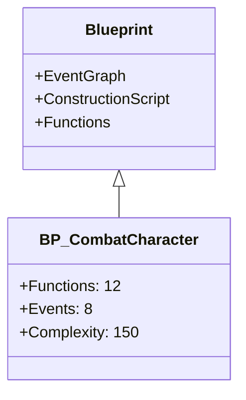
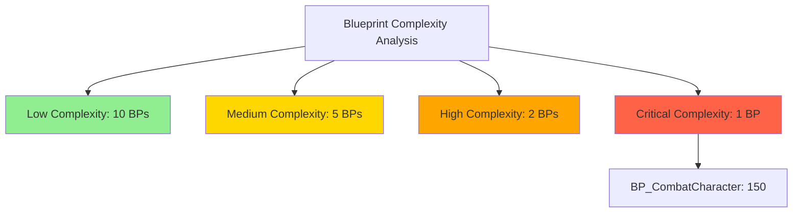

# Blueprint Analyzer Plugin

Advanced performance analysis tool for Unreal Engine 5 Blueprint assets.

## Overview

The Blueprint Analyzer is a comprehensive analysis tool designed to help developers identify performance issues, memory problems, and best practice violations in their Blueprint assets. It supports multiple phases of analysis, from simple filesystem-based checks to deep performance profiling.

## Features

### Phase 2: Unreal Python API Integration ✅ NEW

- **Blueprint Internal Structure Analysis**:
  - Node count and type breakdown
  - Function count and details
  - Event count and identification
  - Variable count and types
  - Macro detection
  - Construction script complexity analysis

- **Dependency Analysis**:
  - Parent class relationships
  - Implemented interfaces tracking
  - Blueprint-to-Blueprint references
  - Asset dependencies
  - Dependency graph generation (Mermaid format)

- **Advanced Reporting**:
  - JSON export with full metrics
  - CSV export for spreadsheet analysis
  - Mermaid dependency diagrams
  - Real Blueprint data extraction (requires Unreal Editor)

### Phase 3: Advanced Performance Analysis

- **Tick Usage Detection**: Identifies EventTick usage and suggests Timer-based alternatives
- **Heavy Operation Detection**: Finds expensive operations like ForEach loops and suggests optimizations
- **Cast Optimization**: Detects excessive Cast operations and recommends interface usage
- **ConstructionScript Analysis**: Warns about heavy ConstructionScript operations affecting editor performance
- **Memory Usage Analysis**: Tracks array/map usage and object references
- **Best Practices Checks**: Validates Event Dispatcher patterns, function design, and naming conventions
- **Auto-Documentation**: Generates Mermaid diagrams and improvement reports

## Installation

The Blueprint Analyzer is included as a plugin in the project. No additional installation is required.

### Directory Structure

```
Plugins/BlueprintAnalyzer/
├── Content/
│   └── Python/
│       ├── unreal_blueprint_api.py          # Phase 2: Unreal API integration
│       └── blueprint_performance_analyzer.py # Phase 3: Performance analysis
└── README.md
```

## Configuration

Configuration is managed via `Config/BlueprintAnalyzer.ini`:

```ini
[Performance]
MaxTickUsage=5
MaxCastPerBlueprint=10
MaxLoopDepth=3
WarnOnConstructionScriptComplexity=true

[Scoring]
TickEventWeight=10
ForEachLoopWeight=5
CastWeight=2
StringOperationWeight=3
```

See `Config/BlueprintAnalyzer.ini` for all available options.

## Usage

### Command Line

#### Phase 2: Detailed Analysis (New!)

```bash
# Run detailed analysis with Unreal Python API
./scripts/analyze-blueprints.sh --detailed

# Export to JSON
./scripts/analyze-blueprints.sh --detailed --format json --output analysis.json

# Export to CSV for Excel
./scripts/analyze-blueprints.sh --detailed --format csv --output analysis.csv

# Generate dependency graph
./scripts/analyze-blueprints.sh --detailed --dependencies

# Analyze specific variant
./scripts/analyze-blueprints.sh --path Content/Variant_Combat --detailed
```

#### Phase 3: Performance Analysis

```bash
# Run performance analysis
./scripts/analyze-blueprints.sh --performance

# Full analysis with report generation
./scripts/analyze-blueprints.sh --full-analysis --output report.md

# CI/CD integration
./scripts/analyze-blueprints.sh --performance --fail-on-critical
```

### Python API

#### Phase 2: Using Unreal Python API (Inside UE Editor)

```python
import sys
sys.path.append('Plugins/BlueprintAnalyzer/Content/Python')

from unreal_blueprint_api import UnrealBlueprintAnalyzer

# Initialize analyzer
analyzer = UnrealBlueprintAnalyzer()

# Get all Blueprints
blueprints = analyzer.get_all_blueprints('/Game/')

# Analyze a specific Blueprint
metrics = analyzer.analyze_blueprint('/Game/Variant_Combat/Blueprints/BP_CombatCharacter')
print(f"Nodes: {metrics.total_node_count}")
print(f"Functions: {metrics.function_count}")

# Analyze all and export
all_metrics = [analyzer.analyze_blueprint(bp) for bp in blueprints if analyzer.analyze_blueprint(bp)]
analyzer.export_to_json(all_metrics, 'blueprint_report.json')
analyzer.export_to_csv(all_metrics, 'blueprint_report.csv')

# Generate dependency graph
print(analyzer.generate_dependency_graph(all_metrics))
```

#### Phase 3: Performance Analysis

```python
from blueprint_performance_analyzer import BlueprintPerformanceAnalyzer, BlueprintMetrics

# Initialize analyzer
analyzer = BlueprintPerformanceAnalyzer("Config/BlueprintAnalyzer.ini")

# Create metrics (normally extracted from Blueprint assets)
metrics = BlueprintMetrics(
    name="BP_CombatCharacter",
    path="/Game/Variant_Combat/Blueprints/BP_CombatCharacter",
    tick_event_count=2,
    cast_count=15,
    foreach_loop_count=3
)

# Analyze
analyzer.analyze_blueprint(metrics)
analyzer.metrics.append(metrics)

# Generate report
report = analyzer.generate_performance_report()
print(report)

# Generate Mermaid diagrams
hierarchy_diagram = analyzer.generate_mermaid_diagram("hierarchy")
complexity_diagram = analyzer.generate_mermaid_diagram("complexity")
```

## Output Examples

### Performance Report

```markdown
## Performance Analysis Report

### Critical Issues
- ❌ **BP_CombatCharacter**: EventTick used 2 times (Score: 150)
  - 💡 Consider using Timers instead of EventTick for better performance
- ❌ **BP_Enemy**: 15 Cast operations detected
  - 💡 Consider implementing interfaces instead of using Cast operations

### Warnings
- ⚠️ **BP_GameMode**: ForEach loop used 5 times
  - 💡 Review loop usage, especially in frequently called functions

### Recommendations
1. **Tick Usage** in BP_CombatCharacter
   - Replace EventTick with Timer for better performance
2. **Cast Optimization** in BP_Enemy
   - Implement ICombatInterface instead of casting
```

### Mermaid Diagrams

**Class Hierarchy:**


**Complexity Visualization:**


## Complexity Scoring

The analyzer calculates a complexity score based on weighted metrics:

- **Tick Events**: Weight 10 (highest impact)
- **ForEach Loops**: Weight 5
- **Cast Operations**: Weight 2
- **String Operations**: Weight 3
- **Array Operations**: Weight 2

Thresholds:
- **Low**: < 50
- **Medium**: 50-100
- **High**: 100-150
- **Critical**: > 150

## Issue Severity Levels

- **Info**: Informational messages, best practice suggestions
- **Warning**: Potential performance issues, should be reviewed
- **Critical**: Significant performance problems, must be addressed

## CI/CD Integration

Use `--fail-on-critical` to fail builds when critical issues are found:

```bash
#!/bin/bash
# In your CI pipeline
./scripts/analyze-blueprints.sh --performance --fail-on-critical --output blueprint-report.md

if [ $? -ne 0 ]; then
    echo "Critical Blueprint issues found! Check blueprint-report.md"
    exit 1
fi
```

## Extending the Analyzer

To add custom analysis checks:

1. Edit `Plugins/BlueprintAnalyzer/Content/Python/blueprint_performance_analyzer.py`
2. Add a new analyzer method:

```python
def analyze_custom_check(self, metrics: BlueprintMetrics):
    """Your custom analysis logic"""
    if metrics.some_metric > threshold:
        issue = PerformanceIssue(
            level=IssueLevel.WARNING,
            blueprint_name=metrics.name,
            issue_type="Custom Check",
            description="Your issue description",
            suggestion="Your recommendation"
        )
        metrics.issues.append(issue)
```

3. Call it from `analyze_blueprint()`:

```python
def analyze_blueprint(self, metrics: BlueprintMetrics) -> BlueprintMetrics:
    # ... existing analyzers ...
    self.analyze_custom_check(metrics)
    return metrics
```

## Phase 2 & 3 Integration ✅

Phase 2 (Unreal Python API integration) is now implemented! The analyzer automatically extracts metrics from Blueprint assets using the Unreal Engine Python API:

**Key Features:**
- Real Blueprint data extraction (nodes, functions, variables, events)
- Dependency tracking (parent classes, interfaces, references)
- Multiple export formats (JSON, CSV, Mermaid diagrams)
- Integration with Phase 3 performance analysis

**Requirements:**
- Unreal Editor running with Python Script Plugin enabled
- Python 3.7+ installed
- Running from within Unreal Editor's Python environment or using `unreal.py` wrapper

**Usage:**
```bash
# Use --detailed flag to enable Phase 2 analysis
./scripts/analyze-blueprints.sh --detailed --format json --output report.json
```

## Limitations

- **Phase 2 Requirement**: Detailed analysis requires Unreal Editor running with Python support. Without it, sample data is used.
- **Runtime Analysis**: The analyzer performs static analysis only, not runtime profiling.
- **Blueprint Nativization**: Does not analyze nativized Blueprints.
- **UE Version**: Optimized for Unreal Engine 5.7, may require adjustments for other versions.

## Troubleshooting

### Python Not Found

If you see "Python not found" warnings:

```bash
# Install Python 3
sudo apt-get install python3  # Linux
brew install python3          # macOS
# Windows: Download from python.org
```

### Analyzer Not Running

Ensure the Python script is executable and in the correct location:

```bash
ls -la Plugins/BlueprintAnalyzer/Content/Python/blueprint_performance_analyzer.py
```

### Configuration Not Loaded

Check that `Config/BlueprintAnalyzer.ini` exists and is properly formatted:

```bash
cat Config/BlueprintAnalyzer.ini
```

## Related Documentation

- [Blueprint Best Practices (UE5)](https://docs.unrealengine.com/5.7/blueprint-best-practices-in-unreal-engine/)
- [Blueprint Performance Guide](https://docs.unrealengine.com/5.7/blueprint-technical-guide/)
- [Project Documentation](../../CLAUDE.md)

## License

This plugin is part of the AntigravityTest Unreal Engine 5 project.

## Contributing

To contribute improvements:

1. Test your changes with various Blueprint types
2. Add appropriate configuration options to `BlueprintAnalyzer.ini`
3. Update documentation
4. Submit a pull request

---

Generated with [Claude Code](https://claude.com/claude-code)
