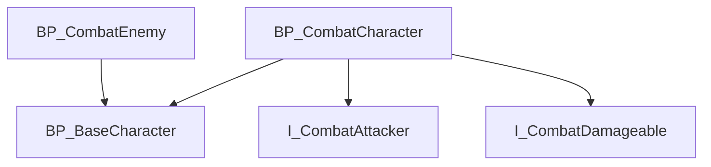

# Blueprint Analyzer Agent Skill - Phase 2: Unreal Python API Integration

## 概要
Blueprint Analyzer Agent SkillのPhase 2実装: Unreal Engine Python APIとの連携による詳細分析機能

## 前提条件
- Phase 1（基本実装）が完了していること（Issue #68で実装済み）
- 既存の軽量版スクリプトを拡張する形で実装

## 主な機能

### Blueprint内部構造の解析
- [ ] Unreal Engine Python APIのセットアップと統合
- [ ] Blueprint内部情報へのアクセス実装
- [ ] ノード数の測定
- [ ] 関数数の測定
- [ ] イベントグラフの複雑度分析
- [ ] 変数数とデータ型の統計

### 依存関係の解析
- [ ] Blueprint間の依存関係抽出
- [ ] アセット参照の追跡
- [ ] 親子クラス関係の可視化
- [ ] インターフェース実装の検出

### レポート機能の拡張
- [ ] 詳細な統計情報の出力
- [ ] 依存関係グラフ（Mermaid形式）の生成
- [ ] 複雑度メトリクスのレポート
- [ ] JSON/CSVフォーマットでのエクスポート

## 技術的アプローチ

### Unreal Python APIの使用
```python
import unreal

# Blueprintアセットの取得
asset_registry = unreal.AssetRegistryHelpers.get_asset_registry()
blueprints = asset_registry.get_assets_by_class('Blueprint')

# Blueprint詳細情報の取得
for bp in blueprints:
    asset = bp.get_asset()
    # ノード数、関数数などの解析
```

### 実装方針
1. **既存スクリプトとの統合**: Phase 1の`analyze-blueprints.sh`を拡張
2. **Python モジュール化**: 再利用可能な分析モジュールを作成
3. **オプション機能**: `--detailed`フラグで詳細分析を有効化
4. **CI/CD対応**: エディタ起動なしでも基本分析は可能に

## 使用例

```bash
# 詳細分析モード
./scripts/analyze-blueprints.sh --detailed

# 依存関係グラフ生成
./scripts/analyze-blueprints.sh --detailed --dependencies

# JSON出力
./scripts/analyze-blueprints.sh --detailed --format json

# 特定のBlueprintのみ分析
./scripts/analyze-blueprints.sh --detailed --path Content/Variant_Combat/Blueprints/BP_CombatCharacter.uasset
```

## 期待される出力

### 統計レポート
- Blueprint毎のノード数、関数数
- 複雑度スコア（ノード数、深さなど）
- 使用されている主要なノードタイプ
- 変数とデータ型の統計

### 依存関係グラフ


## 技術要件
- Unreal Engine 5.7のPython環境
- `unreal`モジュールへのアクセス
- エディタ起動またはコマンドラインツールでの実行

## 参考資料
- [Unreal Engine Python API Documentation](https://docs.unrealengine.com/5.7/scripting-the-unreal-editor-using-python/)
- [Asset Registry](https://docs.unrealengine.com/5.7/asset-registry-in-unreal-engine/)

## 関連Issue
- #68 - Blueprint Analyzer Agent Skill (Phase 1完了)

🤖 Generated with [Claude Code](https://claude.com/claude-code)
