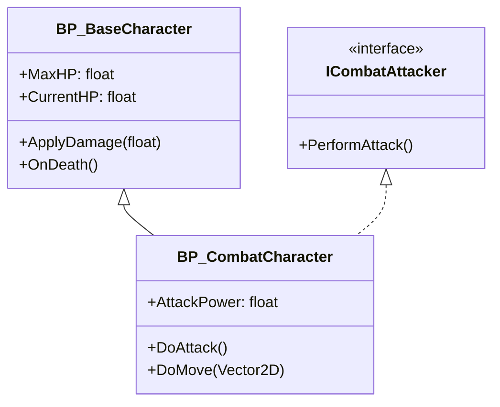

# Blueprint Analyzer Agent Skill - Phase 3: Advanced Performance Analysis

## 概要
Blueprint Analyzer Agent SkillのPhase 3実装: 高度なパフォーマンス分析とドキュメント自動生成

## 前提条件
- Phase 1（基本実装）が完了していること（Issue #68で実装済み）
- Phase 2（Unreal Python API統合）が完了していること
- 既存の分析機能を拡張する形で実装

## 主な機能

### パフォーマンス分析
- [ ] Tick関数の使用状況検出
  - EventTickの使用箇所
  - 頻繁に実行される処理の特定
  - タイマー使用の推奨提案
- [ ] 重い処理の検出
  - ForEachループの使用状況
  - 配列操作の最適化チェック
  - 文字列操作の頻度分析
- [ ] Cast使用の最適化チェック
  - Castノードの使用頻度
  - インターフェース使用推奨
  - 不要なCastの検出
- [ ] ConstructionScript分析
  - 重い処理の警告
  - エディタパフォーマンスへの影響評価

### メモリ使用分析
- [ ] 配列とマップの使用状況
- [ ] オブジェクト参照の管理
- [ ] 大きなアセット参照の検出
- [ ] メモリリーク可能性の検出

### ベストプラクティスチェック
- [ ] Event Dispatcher使用パターン
- [ ] BlueprintCallableな関数の設計
- [ ] コメントとドキュメンテーションの充実度
- [ ] マジックナンバーの検出
- [ ] 命名規則の一貫性

### ドキュメント自動生成
- [ ] Blueprint階層図（Mermaid形式）
  - クラス継承関係
  - インターフェース実装
  - コンポーネント構成
- [ ] 依存関係マップ
  - アセット間の参照関係
  - モジュール間の結合度
- [ ] 改善提案レポート
  - パフォーマンス改善案
  - リファクタリング推奨
  - 優先度付きタスクリスト
- [ ] API ドキュメント生成
  - Public関数一覧
  - イベントとデリゲート
  - 変数とプロパティ

## 技術的アプローチ

### パフォーマンスメトリクスの定義
```python
# 複雑度スコア計算例
def calculate_complexity_score(blueprint):
    score = 0
    score += count_tick_events(blueprint) * 10  # Tick使用は高コスト
    score += count_foreach_loops(blueprint) * 5
    score += count_casts(blueprint) * 2
    score += count_string_operations(blueprint) * 3
    return score

# 閾値に基づく警告
if score > 100:
    warn("High complexity - consider optimization")
```

### 分析ルールの設定
- `Config/BlueprintAnalyzer.ini`で閾値とルールを設定可能
- プロジェクト固有のベストプラクティスを定義
- 警告レベル（Info, Warning, Critical）の設定

## 使用例

```bash
# パフォーマンス分析
./scripts/analyze-blueprints.sh --performance

# 完全な分析とレポート生成
./scripts/analyze-blueprints.sh --full-analysis --output report.md

# 特定のメトリクスのみ
./scripts/analyze-blueprints.sh --performance --metrics tick,cast,loops

# CI/CDでの使用（閾値超過で失敗）
./scripts/analyze-blueprints.sh --performance --fail-on-critical
```

## 期待される出力

### パフォーマンスレポート
```markdown
## Performance Analysis Report

### Critical Issues
- ❌ BP_CombatCharacter: EventTick with expensive operations (Score: 150)
- ❌ BP_Enemy: 15 Cast operations detected - consider interfaces

### Warnings
- ⚠️ BP_GameMode: ForEach loop in frequently called function
- ⚠️ BP_LifeBar: String concatenation in Tick event

### Recommendations
1. Replace EventTick with Timer in BP_CombatCharacter
2. Implement ICombatInterface instead of casting in BP_Enemy
3. Cache string operations in BP_LifeBar
```

### ドキュメント生成


### 改善提案レポート
- 優先度付きタスクリスト
- コード例と推奨パターン
- 期待されるパフォーマンス改善効果

## 実装方針

### フェーズ分け
1. **基本パフォーマンスチェック**: Tick、Cast、ループ検出
2. **詳細メトリクス**: メモリ、複雑度分析
3. **ドキュメント生成**: Mermaid図、レポート
4. **CI/CD統合**: 自動チェックと品質ゲート

### 設定ファイル例
```ini
[Performance]
MaxTickUsage=5
MaxCastPerBlueprint=10
MaxLoopDepth=3
WarnOnConstructionScriptComplexity=true

[Documentation]
GenerateMermaid=true
IncludePrivateFunctions=false
OutputFormat=markdown
```

## 技術要件
- Phase 2のUnreal Python API統合が完了
- Blueprint内部ノードへの詳細アクセス
- メトリクス計算とスコアリングロジック
- Mermaid図生成ライブラリ

## 参考資料
- [Blueprint Best Practices](https://docs.unrealengine.com/5.7/blueprint-best-practices-in-unreal-engine/)
- [Blueprint Performance](https://docs.unrealengine.com/5.7/blueprint-technical-guide/)
- [Optimization Guidelines](https://docs.unrealengine.com/5.7/performance-and-profiling-in-unreal-engine/)

## 関連Issue
- #68 - Blueprint Analyzer Agent Skill (Phase 1完了)
- Phase 2のIssue番号（Phase 2 Issue作成後にリンク）

🤖 Generated with [Claude Code](https://claude.com/claude-code)
